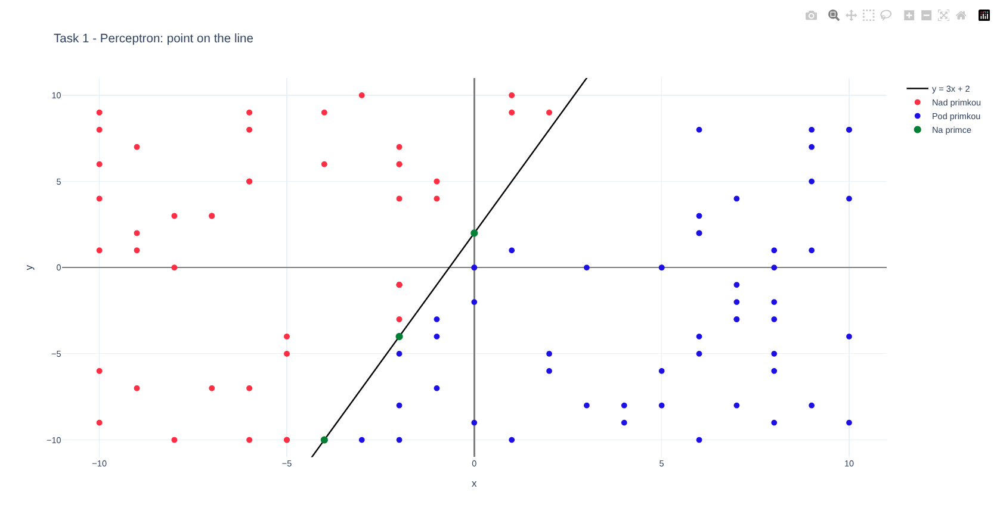
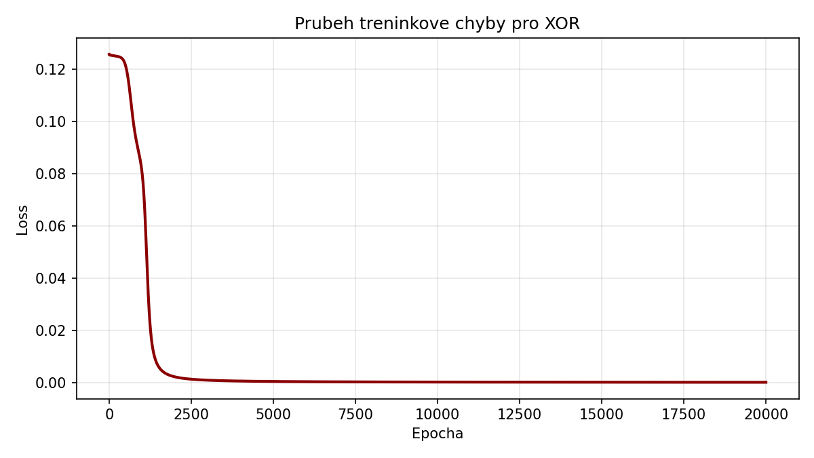
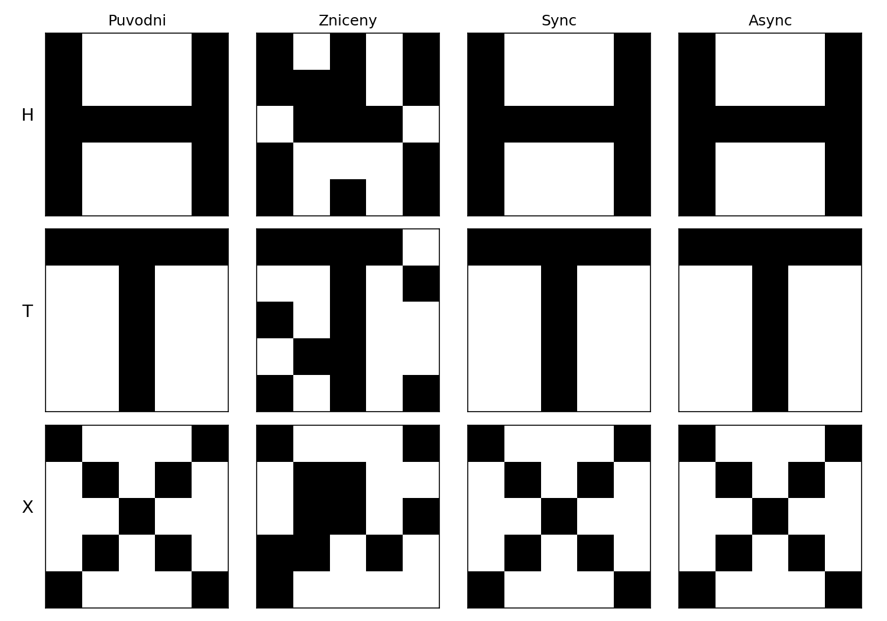
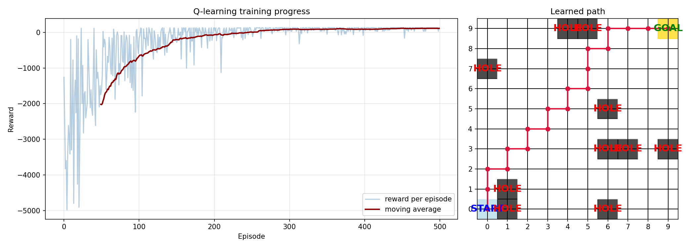

# CV1 - perceptron

```
python cv1.py
```



# CV2 - XOR neural network

```
python cv2.py
```


# CV3 - Hopfield network

```
python cv3.py
```


# CV4 - Q-learning, Find the cheese

```
python cv4.py
```


